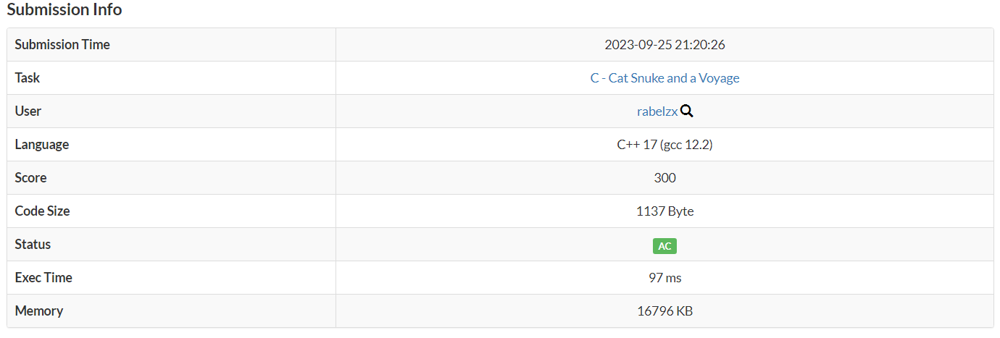
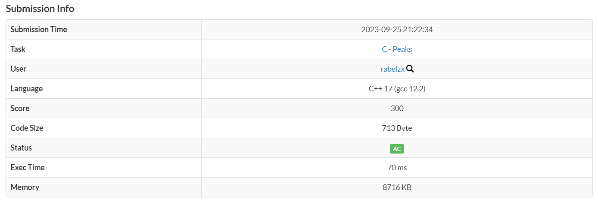
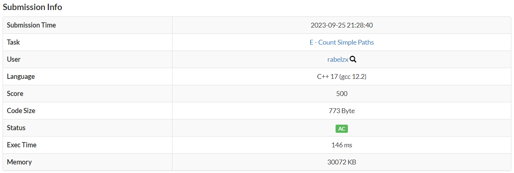
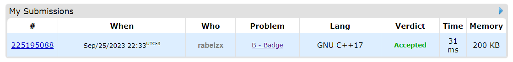

# Exercícios do AtCoder e Codeforces

**Conteúdo da Disciplina**: Grafos 1 

## Alunos
|Matrícula | Aluno |
| -- | -- |
| 21/1030729  |  Eric Rabelo Borges |
| 19/0058455  |  Mariana Oliveira Pires do Rio |

## Sobre 
Este projeto contém as resoluções de exercícios de Juiz Online (AtCoder e Codeforces) que envolvem algoritmos de busca em largura (BFS) e busca em profundidade (DFS). 

### Exercício 1:  [Cat Snuke and a Voyage](https://atcoder.jp/contests/abc068/tasks/arc079_a)

O exercício consiste em determinar se Cat Snuke, que está na Island 1, pode chegar à Island N em Takahashi Kingdom usando no máximo dois serviços de barco. A solução emprega um algoritmo de busca em largura (BFS) para explorar as conexões entre as ilhas por meio dos serviços de barco. Ao iniciar a busca a partir da Island 1, o algoritmo rastreia a distância percorrida e, se encontrar a Island N em dois movimentos ou menos, a resposta é "POSSIBLE". Caso contrário, a resposta é "IMPOSSIBLE". Isso permite a Cat Snuke determinar se ele pode alcançar seu destino com as restrições de uso de serviços de barco.

- [Ir para solução](Soluções/CatSnukeandaVoyage.cpp)

### Exercício 2:  [Peaks](https://atcoder.jp/contests/abc166/tasks/abc166_c)

O exercício consiste em descobrir quantos bons observatórios existem em AtCoder Hill, para descobrir essa quantidade deve-se verificar se a altitude do observatório é superior aos demais observatório que podem ser alcançados a partir de Obs.i ultilizando apenas uma estrada.
Para a solução temos um grafo em lista de adjacencia que guarda as ligacoes entre elas, apartir disso fazemos busca em largura (BFS) para encontramos os observatório desejados e paramos quando verificamos que a altura do observatório é menor do que os envolta.

- [Ir para solução](Soluções/Peaks.cpp)

### Exercício 3:  [Count Simple Paths](https://atcoder.jp/contests/abc284/tasks/abc284_e)

Neste exercício, você recebe um grafo não direcionado com N vértices e M arestas, e o objetivo é determinar o número de caminhos simples que partem do vértice 1, com a restrição de que o grau de cada vértice não ultrapassa 10. A solução utiliza busca em profundidade (DFS) para explorar o grafo, mantendo um contador de caminhos e limitando a contagem a 10^6 para otimização, resultando no menor valor entre o número de caminhos encontrados e 10^6 como saída.

- [Ir para solução](Soluções/CountSimplePaths.cpp)

### Exercício 4:  [Badge](https://codeforces.com/contest/1020/problem/B)

Na Summer Informatics School, quando os alunos nao se comportam bem os professores fazem um furo na "Badge", medalha, do aluno. e hoje um professor pegou um grupo de alunos fazendo "Bagunca", entao o professor faz um furo na medalha do aluno 'a', mas esse por sua vez acusa que o principal culpado foi o aluno 'pa' que tambem toma um furo em sua medalha, que por sua vez acusa que foi o 'ppa'. Por fim ele decide que o verdadeiro culpado, seria o aluno com dois furos em sua medalha.
Para a resolução desse exercício pegamos os numeros de vértice e arestas, depois aplicamos uma DFS partindo de cada um dos vértice ate que ele chegue em algum que ja foi visitado e apartir disso ele indica qual o aluno foi acusado.

- [Ir para solução](Soluções/Badge.cpp)

## Screenshots

### Cat Snuke and a Voyage 

### Peaks

### Count Simple Paths

### Badge

## Instalação 
Não é necessario instalação, as soluções podem ser submetidas nos sites: [AtCoder](https://atcoder.jp/) e [Codeforces](https://codeforces.com/).

**Linguagem**: C++ 

## Apresentação
Assista o vídeo explicativo do projeto clicando [aqui](/Apresentação.mp4).  
*Observação: A apresentação está em formato .mp4, portanto, faça o download para assisti-la.*

